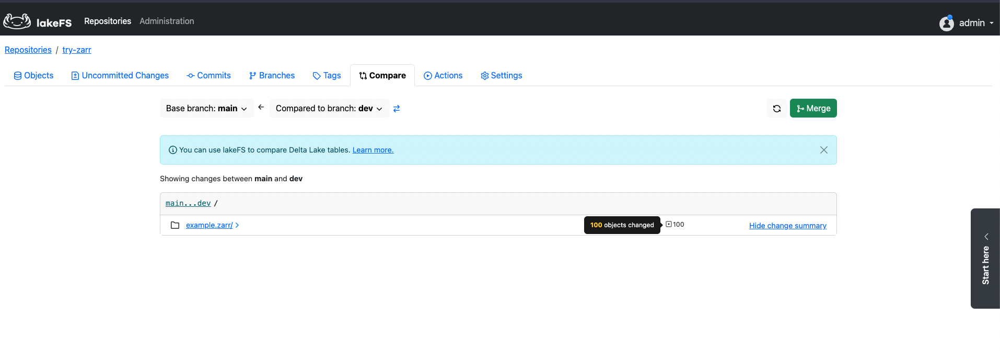

# Zarr with lakefs example

This repository demonstrates the usage of Zarr in combination with lakeFS for version-controlled data storage and manipulation. Zarr is a storage format for array data that is particularly well-suited for handling large datasets efficiently. lakeFS, on the other hand, provides version control capabilities for data lakes, enabling easy tracking and management of changes to data stored in object storage.

# Overview 
In this example, we showcase the following steps:

1- Creation of a Zarr store locally.

2- Uploading the Zarr store to the main branch of the lakeFS repository.

3- Updating the Zarr store by modifying the value at index [2][2].

4- Committing the updated Zarr store to the dev branch.

In the `main.py` file, you can find the code snippet that illustrates how to read the Zarr store from different branches using the lakeFS API. This snippet is designed to help you understand how to access and work with your version-controlled data in a flexible and efficient manner.

